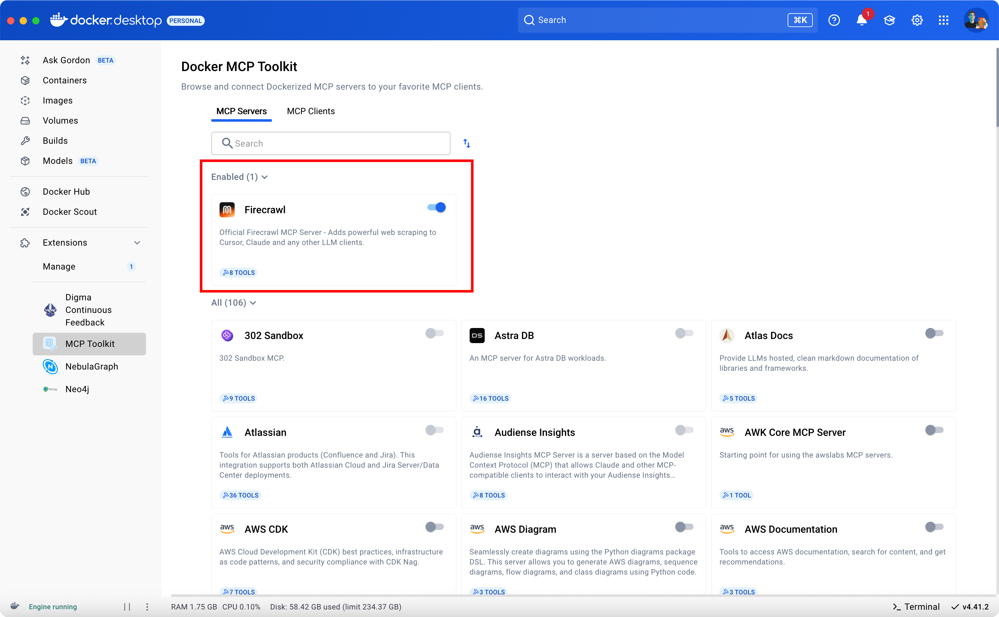

# 🔍 CAMEL-AI + MCP: Docker Toolkit Search Tool

This example demonstrates how to use the [CAMEL-AI OWL framework](https://github.com/camel-ai/owl) and **MCP (Model Context Protocol)** to search for Docker Toolkit related content. The tool leverages intelligent agents to gather and organize documentation, tutorials, best practices, and troubleshooting guides.

---

## ✨ Use Case

> _"Search and organize Docker Toolkit related content including technical documentation, video tutorials, best practices, and optimization guides. Return results in a structured format with descriptions and links."_

Agents coordinate to perform comprehensive searches and return well-organized results in Markdown format.

---

## 📦 Setup

### 1. Clone and install dependencies

```bash
git clone https://github.com/camel-ai/owl
cd owl
pip install -r requirements.txt
```

### 2. Configure MCP Server

Create `mcp_servers_config.json` in the project directory:

```json
{
  "mcpServers": {
    "MCP_DOCKER": {
      "type": "stdio",
      "command": "docker",
      "args": [
        "run",
        "-l",
        "--rm",
        "-i",
        "alpine/socat",
        "STDIO",
        "TCP:host.docker.internal:8811"
      ]
    }
  }
}
```

> 🛠️ Make sure to set up your environment variables in `.env` file.

### 3. Run the Search Tool

```bash
python docker_content_search.py
```

You can customize the search query by modifying the `default_task` in `docker_content_search.py`:

```python
default_task = (
    "Please help me search for Docker Toolkit related content:\n"
    "1. Docker Toolkit technical documentation and official guides\n"
    "2. Docker Toolkit video tutorials and practical cases\n"
    # ...customize your search requirements...
)
```

---

## 🧠 How It Works

- **MCPToolkit** connects to the search service
- **OWL RolePlaying Agents** simulate a conversation between:
  - `docker_content_curator`: Manages content requirements
  - `docker_tech_expert`: Executes searches and formats results
- Results are saved as Markdown files in the `search_results` directory

## 📄 Output Format

Search results are organized in the following sections:
- Documentation and Guides
- Video Tutorials
- Best Practices
- Troubleshooting and Optimization

Each entry includes:
- Title with link
- Brief description
- Additional metadata (duration, author for videos)

---

## 🚧 Notes

### Prerequisites
- Docker Desktop must be installed and running
- MCP Toolkit must be installed in Docker:
- Firecrawl plugin must be configured in MCP Toolkit:
  

### General Notes
- Uses **DeepSeek** model for both user and assistant roles
- Supports async execution and error handling
- Includes retry mechanism for reliability
- Saves results in timestamped Markdown files

---

## 🌟 Docker MCP Toolkit Advantages

### Simplified Management
- **One-Time Setup**: Configure Docker MCP once to access all MCP services in the Docker MCP marketplace
- **Automated Resource Management**: 
  - On-demand container startup
  - Automatic credential injection
  - Container termination after task completion
  - Efficient resource utilization

### Enhanced Security
- **Runtime Protection**: 
  - Container isolation protection
  - Limited host system access
  - Sandboxed environment
- **Credential Management**:
  - Built-in OAuth support
  - Secure credential storage
  - No plaintext environment variables

### Developer Productivity
- **Tool Discovery**: Verified high-quality MCP tools through Docker Hub
- **Simplified Configuration**: 
  - Automatic dependency handling
  - Environment management
  - No manual service hosting required
- **Standardized Integration**: Unified interface and management approach

Docker MCP Catalog and Toolkit's core design philosophy is to make MCP tools simple and secure to use, fundamentally changing how developers manage MCP tools by providing better structure, trustworthiness, and scalability.


## 📌 References

- [CAMEL-AI GitHub](https://github.com/camel-ai/camel)
- [OWL Framework](https://github.com/camel-ai/owl)
- [MCP Documentation](https://docs.anthropic.com/claude/docs/model-context-protocol)
- [DeepSeek Models](https://api-docs.deepseek.com/)
- [Docker Toolkit](https://www.docker.com/products/mcp-catalog-and-toolkit/)
- [Docker MCP Toolkit Installation Guide](https://www.cloudesx.com/article/mcp-server-docker)
